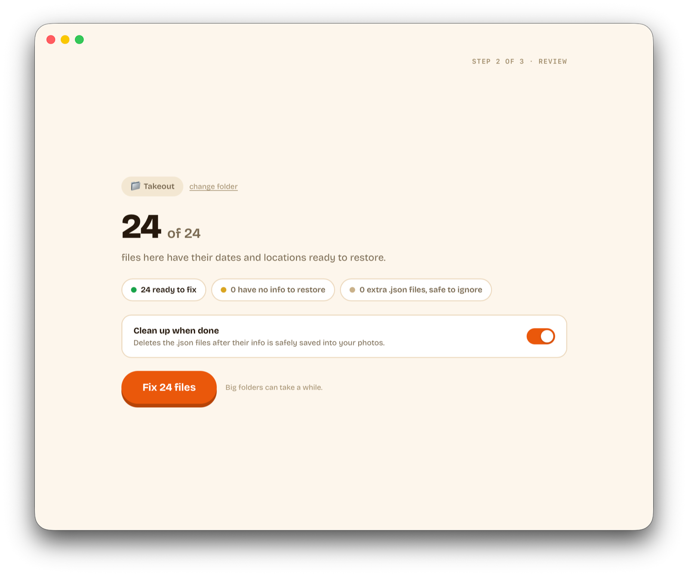
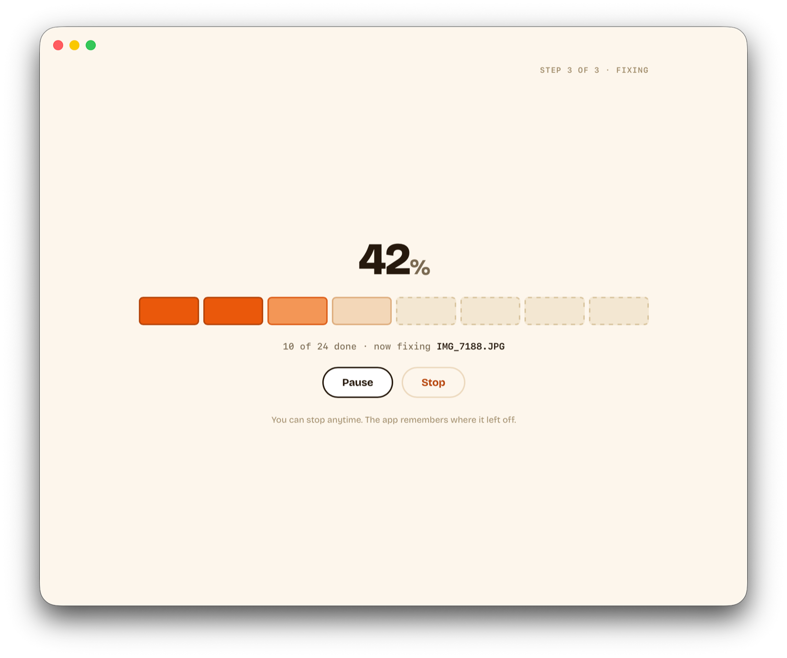
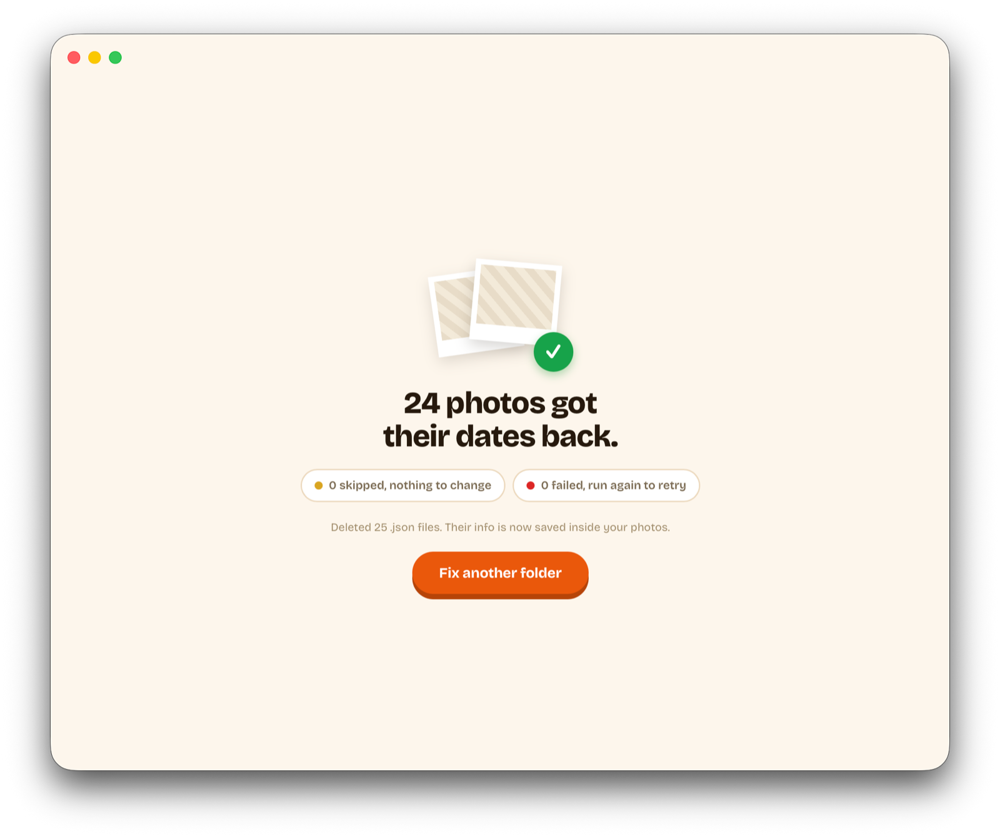

# Takeout Metadata Fixer

A small desktop app for **Google Takeout** folders. It reads the JSON files sitting next to your photos and videos and writes the dates, GPS, and related info into the media files with [ExifTool](https://exiftool.org/). Imports into iCloud, a NAS, or other apps then show the right dates and places.

**ExifTool is required.** The app looks for it on your `PATH` and in the usual install locations (Homebrew paths on macOS).

## Download

macOS (DMG) and Windows (`.exe`): [GitHub Releases](https://github.com/MRdevX/takeout-md-fixer/releases).

## Screenshots

Pick a folder; the app checks that ExifTool is available.


Review the summary, then start. You can delete the sidecar JSON after a successful run.



Pause or stop at any point.



You get counts for succeeded, skipped, and failed files.



## Resuming

Progress is stored in `.takeout-md-fixer-checkpoint.json` inside the folder you picked. Reopen that folder to carry on where you left off; delete the file to start over.

## Develop

You need Go (version in [`go.mod`](go.mod)), Node.js, ExifTool, and the Wails v3 CLI. **Install the CLI at the same version as `wails/v3` in `go.mod`** — v3 is alpha and the CLI and library drift apart:

```bash
brew install exiftool
go install github.com/wailsapp/wails/v3/cmd/wails3@v3.0.0-alpha.74
```

Make sure Go's bin directory is on your `PATH` (add it to your shell profile):

```bash
export PATH="$PATH:$(go env GOPATH)/bin"
```

Then run the app:

```bash
wails3 dev -config ./build/config.yml
```

`wails3` has a task runner built in, so you don't need a separate `task` binary.

| Command | Does |
| --- | --- |
| `wails3 dev -config ./build/config.yml` | Run with live reload |
| `wails3 task ci:local` | Frontend build, gofmt, vet, tests — same as CI |
| `wails3 build` | Build into `bin/` |
| `bash scripts/build-release.sh` | Release build (macOS DMG, Windows). Optional `VERSION=x.y.z` |

Notes:

- The UI lives in `frontend/`; its production output goes to `frontend/dist`, which is gitignored and embedded from [`main.go`](main.go). Run `npm ci && npm run build` in `frontend/` before any `go build`, `go vet`, or `go test` at the repo root — or just use `wails3 task ci:local`.
- Most logic is in `internal/service` (app flow, checkpoints), `internal/takeout` (Takeout JSON, file matching), and `internal/exif` (ExifTool).
- Changed a Go API the UI calls? Regenerate with `wails3 generate bindings`.
- The icon source is [`build/appicon.svg`](build/appicon.svg). After editing it, re-render and regenerate the platform icons:

  ```bash
  qlmanage -t -s 1024 -o build build/appicon.svg && mv build/appicon.svg.png build/appicon.png
  wails3 task common:generate:icons
  ```

---

**Mahdi Rashidi** — [contact@mrashidi.me](mailto:contact@mrashidi.me) · [mrashidi.me](https://mrashidi.me) · [GitHub](https://github.com/MRdevX) · [Buy Me a Coffee](https://www.buymeacoffee.com/mrdevx)
